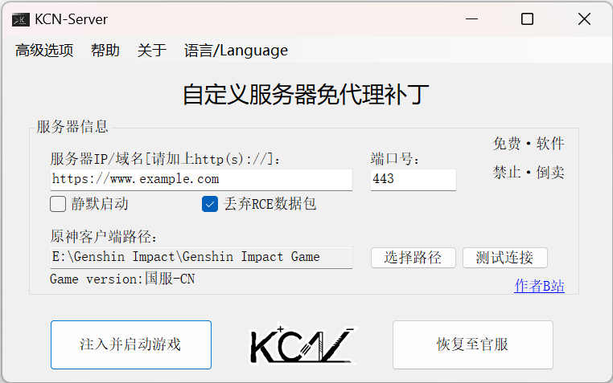

# mhypbase-Agent-free-Patch
#### 中文|[English](README_en_US.md)

> 原神客户端一键式自定义服务器免代理补丁。

---

### 特别提示：
- 此项目不再适用于 `3.5.0` 版本后的客户端。对于新版本客户端，请使用 [RSAPatch](https://github.com/34736384/RSAPatch) 。

### 软件下载：
- 请到最新[Releases](https://github.com/JDDKCN/mhypbase-Agent-free-Patch/releases/)处下载。

### 软件截图 ： 
- v0.3.0Beta 2023/03/17

### 更新日志 ： 

- 软件优化 修复问题 v0.3.4Beta
1. 修复了一些bug。
2. 增加了工具选项。

- 软件优化 修复问题 v0.3.3Beta
1. 添加了安装程序。
2. 修复了一些bug。

- 软件优化 修复问题 v0.3.2Beta
1. 修复了输入链接时可能报错的问题。
2. 优化了软件代码。

- 紧急更新 修复问题 v0.3.1Beta
1. 修复了国际服无法使用的问题。

- 新增功能/修复问题 v0.3.0Beta
1. 添加多语言选项，语言文件可在languages文件夹里编辑。
2. 现在可以方便的更改私钥/公钥了。具体内容请在高级选项菜单中查看。
3. 可以选择是否丢弃服务器传来的RCE数据包。 - 这可能会对您的电脑造成潜在威胁。
4. 修复了3.2真端无法连接的Bug。
5. 优化了代码。

### 使用方法：
- 开始使用
1. 填写远程(或本地)服务器地址与端口号(服务器地址请加上http://或https://)。
2. 选择原神客户端路径(国服为YuanShen.exe，国际服为GenshinImpact.exe)。
3. 点击"注入并启动游戏"，即可游玩您设置的远程服务器。
4. 游玩官服时点击"恢复至官服"后，即可正常游玩。
- 注意事项
1. 本程序只支持有效SSL证书的https地址。若没有有效SSL证书，请把服务端降级为http模式连接(GC的降级方法为删除服务端根目录下的keystore.p12文件)。
2. 若连接本地服务器，一般地址为：http://127.0.0.1，端口号为：443。
3. 不建议取消勾选"丢弃RCE数据包"选项，这可能会给您的电脑带来安全隐患。
4. 若勾选"静默启动"选项，将不显示命令提示符的黑框。
5. 若无需要，请勿更改"高级选项"里的内容。这极有可能会导致无法连接或一些意料之外的问题。

### 免责声明：
- 本程序是基于Github开源项目[mhypbase](https://github.com/Jx2f/mhypbase)制作的原神客户端一键式免代理补丁，仅供研究交流用，禁止用于商业及非法用途。使用本软件造成的事故与损失，与作者无关。本程序完全免费，如果您是花钱买的，说明您被骗了。请尽快退款，以减少您的损失。
