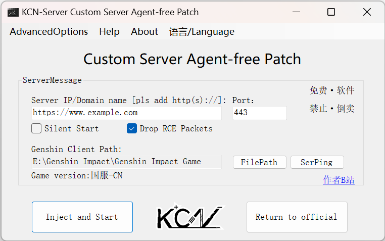

# mhypbase-Agent-free-Patch
#### [中文](README.md)|English

> Genshin client one-click custom server agent-free patch.

---

### software download:
- Please go to the latest [Releases]() to download.

### Software screenshot:
- v0.3.0Beta 2022/03/17

### Update log:
- New features/bug fixes v0.3.0Beta
1. Add multi-language option, language files can be edited in the languages folder.
2. Now you can easily change the private key/public key. For details, please check the advanced options menu.
3. You can choose whether to discard the RCE data packets sent by the server. - This may pose a potential threat to your computer.
4. Fixed the bug that the 3.2 real terminal could not connect.
5. Optimized the code.

### Instructions:
- start using
1. Fill in the remote (or local) server address and port number (please add http:// or https:// to the server address).
2. Select the path of the Yuanshen client (YuanShen.exe for the national server, GenshinImpact.exe for the international server).
3. Click "Inject and start the game" to play the remote server you set.
4. After clicking "Revert to Official Server" when playing the official server, you can play normally.
- Precautions
1. This program only supports https addresses with valid SSL certificates. If there is no valid SSL certificate, please downgrade the server to http mode connection (the downgrade method of GC is to delete the keystore.p12 file in the root directory of the server).
2. If connecting to a local server, the general address is: http://127.0.0.1, and the port number is: 443.
3. It is not recommended to uncheck the "Discard RCE packets" option, which may bring security risks to your computer.
4. If the "Silent Start" option is checked, the black box of the command prompt will not be displayed.
5. Do not change the content in "Advanced Options" unless necessary. This will most likely result in an inability to connect or some unexpected issues.

### Disclaimer:
- This program is based on the one-click agent-free patch of Yuanshen client made by the Github open source project [mhypbase](https://github.com/Jx2f/mhypbase). It is only for research and exchange, and commercial and illegal use is prohibited. Accidents and losses caused by the use of this software have nothing to do with the author. This program is completely free, if you paid for it, you are being scammed. Please refund as soon as possible to reduce your loss.
